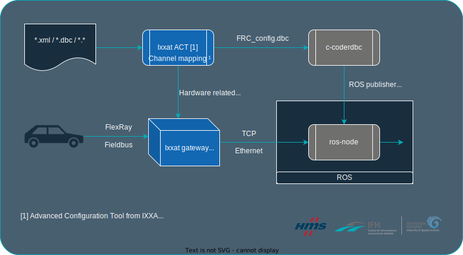

<div align="center">
  <p>
    <a align="center" href="https://www.hs-kempten.de/ifm" target="_blank">
      </a>
  </p>

<!-- Badges -->

[](https://opensource.org/licenses/MIT)
[](https://svgshare.com/i/Zhy.svg)
[](https://svgshare.com/i/ZhY.svg)

</div>

# [Introduction](#introduction)

**FROS** is a node framework to integrate an [Fieldbus](https://en.wikipedia.org/wiki/Fieldbus) into the [Robot Operating System (ROS)](https://www.ros.org/). 
This project depends on the use of an [Ixxat FRC-EP170](https://www.ixxat.com/products/automotive-solutions/overview/embedded-platform/frc-ep-170?ordercode=1.01.0142.00000) or [Ixxat FRC-EP190](https://www.ixxat.com/products/automotive-solutions/overview/embedded-platform/frc-ep-190?ordercode=1.13.0094.00000) gateway device, which to our knowledge are one of the few gateway devices on the market that can be easily integrated into a ROS environment. ROS is widely used for research and in commercial products in the field of robotics. It allows an easy integration of different sensor types into a common environment and due to its open source nature, many different software packages and drivers are already openly available.

In order to extend the ecosystem beyond the widely used CAN and Ethernet standard to include FlexRay in ROS, we provide this framework for the currently available Ixxat gateways [Ixxat FRC-EP170/190](https://www.ixxat.com/products/automotive-solutions/overview/embedded-platform/frc-ep-190?ordercode=1.13.0094.00000). This node handles all the functionalities for interacting with the device and publishes the received messages as topics in ROS. 
### [Physical requirements](#physical-requirements)
- Gateway device
- Fieldbus definition file (e.g. **.xml* / **.dbc*)

### [Supported Fieldbus systems](#supported-fieldbus-systems)
- [FlexRay](https://www.ixxat.com/technologien/automotive/flexray)
- [CAN](https://www.ixxat.com/technologies/fieldbuses/can)

---

# [Table of contents](#table-of-contents)
- [Introduction](#introduction)
  - [Phyiscal requirements](#physical-requirements)
  - [Supported Fieldbus systems](#supported-fieldbus-systems)
- [Table of contents](#table-of-contentspushpin)
- [Process](#process)
  - [Modules](#modules)
    - [ROS-node](#ros-node)
    - [c-coderdbc](#c-coderdbc)
  - [Software requirements](#software-requirements)
  - [Workflow](#workflow)
    - [ACT Setup](#act-setup)
    - [Channel Mapping](#channel-mapping)
  - [Know issues](#known-issues)
- [License](#license)
- [Contact](#contact)
---

# [Process](#process)
The following section will give you a fundamentel overview of the project and its single modules. We will also provide you information to get you own project running. In the area of research, oftentimes the necessary tools need to be developed and be available fast and the role of tools is overshadowed by potential results. The requirements for a research project may change and the adaption and expansion of the previous research topic needs to happen fast. Thus, the here presented framework is built with auto code generation in mind. A provided **.dbc* network description is used to automatically generate all the relevant code snippets and files.

[[↑ to top ↑](#table-of-contents)]

---

## [Modules](#modules)
The module FROS currently consists of:
### [ROS-node](#ros-node)
The framework itself ([ros-node](./ros-node/)) for ROS that handles the connection to the device and the ROS publishers.

### [C-coderdbc](#c-coderdbc)
 C-coderdbc ([c-coderdbc](./c-coderdbc/)) as a fork of the c-coderdbc by github.com user [astand](https://github.com/astand). This program was created to output C source code from a given **.dbc* file. It has been modified for this use case to output:
    - a more elegant C code based on C structs
    - outputs copy-paste ready code snippets to handle the initialization of ROS publishers, to call the appropriate functions based on the message ID and also to generate the necessary **.msg* files for ROS.

The FROS framework is setup as such, that the relevant code snippets can be easily integrated.

<div align="center">
  
</div>

[[↑ to top ↑](#table-of-contents)]

---

## [Software requirements](#software-requirements)
To follow the process steps, we recommend the following setup:
- `Linux Ubuntu 20.04.5 LTS`
- `IXXAT ACT 6 (on Windows)`
- `ROS noetic`

## [Workflow](#workflow)
To integrate the Ixxat FRC into ROS, we will demonstrate the workflow in the following by using CAN as fieldbus. Therefore, we use the public available configuration file from [commaai](https://github.com/commaai/opendbc/blob/d585a9bf2908b2c83bf02b567b9e1f5bfc587a01/vw_mqb_2010.dbc). We adapted this software project to work two specific possible configurations. One configuration maps a selection of whole frames to GenEthernet, the other maps a selection of whole PDUs to GenEthernet. A third possible configuration, the mapping of all frames to GenEthernet, is not included in this release. This would require a different processing of the message ID.

Generally, the customer support and engineers at *HMS* will be able to assist you with your project plans. In the following paragraph, we can provide you with hints how to setup your environment so the outcome fits best for you.

### [ACT Setup](#act-setup)
Open Ixxat ACT and:

1. Select __New project__ and

2. Select __Gateway__  <br/>
 

3. Select your device <br/>


4. Add GenEthernet to your project <br/>


5. Keep file description empty as for now and continue with OK <br/>


6. Ensure the following settings: 
- __Remote device__: "FRC Device"
- __Role__: Slave
- __Optimize for__: Neutral 
- __Interface__: LAN 
- __Port__: 19227 <br/>


7. Add database file (**.dbc*, **.xml*, ...) to e.g. CAN-1 (since we use CAN (`vw_mqb_2010.dbc` from [commaai](https://github.com/commaai/opendbc/blob/d585a9bf2908b2c83bf02b567b9e1f5bfc587a01/vw_mqb_2010.dbc)) as workflow example) or FR-1 A / B. This depends on your use case and available fieldbus.
<br/>


8. Click "next" to contineu

9. Navigate to Tools > Options > Gateway and activate __Adopt Source ID__
<br/>


Now the project is configured and we are able to map the data from Bus to Generic Ethernet (GenEthernet)
### [Channel Mapping](#channel-mapping)
To apply the mapping, follow the following steps: 

10. Select __GenEthernet__ [1]
11. Select __Messages__ [2]
12. On the left column select __Messages__ [3]
<br/>


>Hint: If FlexRay is your fieldbus, you have to generate a **.dbc* file from **.xml* by using `Flx2CanDb`, which will provided to you by IXXAT on request. 

Apply mapping: 

13. Drag & Drop the messages from left onto GenEthernet on right side 

14. Build configuration

15. Inside the project folder, the file `project_dir/DeviceConfig/0/GenEthernet-1.1.dbc` will appear

16. Mapped channles are inside the generated `GenEthernet-1.1.dbc`

17. Download configuration to Device via IxAdmin (will be installed with ACT)

>Switch to Linux OS and copy the created files

18. Build c-coderdbc according to the instruction given in the [readme](https://github.com/AdriveLivingLab/c-coderdbc/blob/9af0fbd15538052d8887cb7610b9b6477e62b497/README.md).

19. Parse original database file (already used in 7.) to c-coderdbc CLI

```./coderdbc -dbc ./vw_mqb_2010.dbc -out ./example -drvname example_gw```

20. Copy the generated publisher into

`./ros-node/src/FRos.cpp` in line `#269`

21. Copy the generated messages into

` ./ros-node/src/FRos.cpp` in line `#348`

22. Build ros node with 

```catkin_make```

The CMakeList.txt will be automatically adopted to the messages, whilst generating the outcome of the c-dbcparser.

## [Start ROS node](#start-ros-node)

After compilation the following steps are required to start the node: 
1. ```source devel/setup.bash```
2. ```roslaunch ixxat_gw ixxat_gw.launch```

[[↑ to top ↑](#table-of-contents)]

---

# [Known issues](#known-issues)

> **_ISSUE #1_:**  FlexRay allows for PDUs, and as such also its signals, to appear in more than one frame. This way, a specific PDU might be updated more frequently by, e.g. publishing it in two separate frames. Thus, with the analysis of only one of the two frames, there is data lost and the observed updaterate of the signals is halved. 

> **_SOLUTION #1.1_:** 
- Observe all frames that include this PDU, and with that the signal, and fuse them together in post-processing.
> **_SOLUTION #1.2_:** 
- Change the configuration to map PDUs to GenEthernet, as such the signals will be updated by all the frames the PDU happens to be included.

[[↑ to top ↑](#table-of-contents)]


# [License](#license)
[](https://opensource.org/licenses/MIT)

# [Contact](#contact)

<div style="width: 50%; float:left" align="center">
  <a href="https://www.instagram.com/fza_hskempten/" style="text-decoration:none;"> &nbsp; </li> 
  <a href="https://www.youtube.com/@ifm8936" style="text-decoration:none;"> &nbsp;
  <a href="https://de.linkedin.com/company/institute-for-driver-assistace-and-connected-mobility" style="text-decoration:none;"> &nbsp; 
  <a href="mailto:livinglab.info@hs-kempten.de" style="text-decoration:none;"> &nbsp; 
  <br/>
  <a href="#" style="text-decoration:none;"> 
</div>

<div style="width: 50%; float:right" align="center">
  <a href="https://www.instagram.com/hmsnetworks/" style="text-decoration:none;"> &nbsp; </li> 
  <a href="https://www.youtube.com/c/IxxatbyHMSNetworks" style="text-decoration:none;"> &nbsp;
  <a href="linkedin.com/company/hmsnetworks" style="text-decoration:none;"> &nbsp; 
  <a href="mailto:info@hms-networks.de" style="text-decoration:none;"> &nbsp; 
  <br/>
  </br>
  <a href="#" style="text-decoration:none;"> 

</div> 

[ [↑ to top ↑](#table-of-contents) ]