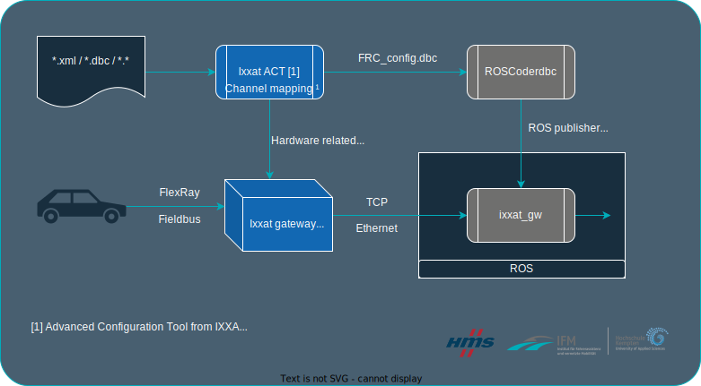

<div align="center">
  <p>
    <a align="center" href="https://www.hs-kempten.de/ifm" target="_blank">
      </a>
  </p>

<!-- Badges -->

[](https://travis-ci.org/anfederico/clairvoyant)


[](https://opensource.org/licenses/MIT)
[](https://svgshare.com/i/Zhy.svg)
</div>

# [Introduction](#introduction)

**FROS** is a node framework to integrate an [Fieldbus](https://en.wikipedia.org/wiki/Fieldbus) into the [Robot Operating System (ROS)](https://www.ros.org/). 
This project depends on the use of an [Ixxat FRC-EP170](https://www.ixxat.com/products/automotive-solutions/overview/embedded-platform/frc-ep-170?ordercode=1.01.0142.00000) or [Ixxat FRC-EP190](https://www.ixxat.com/products/automotive-solutions/overview/embedded-platform/frc-ep-190?ordercode=1.13.0094.00000) gateway device, which to our knowledge are one of the few gateway devices on the market that can be easily integrated into a ROS environment. ROS is widely used for research and in commercial products in the field of robotics. It allows an easy integration of different sensor types into a common environment and due to its open source nature, many different software packages and drivers are already openly available.

In order to extend the ecosystem beyond the widely used CAN and Ethernet standard to include FlexRay in ROS, we provide this framework for the currently available Ixxat gateways [Ixxat FRC-EP170/190](https://www.ixxat.com/products/automotive-solutions/overview/embedded-platform/frc-ep-190?ordercode=1.13.0094.00000). This node handles all the functionalities for interacting with the device and publishes the received messages as topics in ROS. 
### [Physical requirements](#physical-requirements)
- Gateway device
- Fieldbus definition file (e.g. **.xml* / **.dbc*)

### [Supported Fieldbus systems](#supported-fieldbus-systems)
- [FlexRay](https://www.ixxat.com/technologien/automotive/flexray)
- [CAN](https://www.ixxat.com/technologies/fieldbuses/can)

---

# [Table of contents](#table-of-contentspushpin)
- [Introduction](#introduction)
  - [Phyiscal requirements](#physical-requirements)
  - [Supported Fieldbus systems](#supported-fieldbus-systems)
- [Table of contents](#table-of-contentspushpin)
- [Code generation over handwork](#code-generation-over-handworkpushpin)
- [Composition](#compositionpushpin)
- [Software build](#software-buildpushpin)
- [Gateway Setup](#gateway-setuppushpin)
    - [ACT Project setup](#act-project-setup)

---

# [Code generation over handwork](#code-generation-over-handwork)
In the area of research, oftentimes the necessary tools need to be developed and be available fast and the role of tools is overshadowed by potential results. The requirements for a research project may change and the adaption and expansion of the previous research topic needs to happen fast.
Thus, the here presented framework is built with auto code generation in mind. A provided **.dbc* network description is used to automatically generate all the relevant code snippets and files.

[ [↑ to top ↑](#table-of-contentspushpin) ]

---

# [Composition](#composition)

Currently FROS consists of:
1. [The framework itself](./framework/main/) for ROS that handle the connection to the device and the ROS publishers.
2. [ROSCoderdbc](./framework/roscoderdbc/) is a fork of the c-coderdbc by github.com user [astand](https://github.com/astand). This program was created to output C source code from a given .dbc file. It has been modified for this use case to output a more elegant C code based on C structs and also outputs copy-paste ready code snippets to handle the initialization of ROS publishers, to call the appropriate functions based on the message ID and also to generate the necessary **.msg* files for ROS.

The FROS framework is setup as such, that the relevant code snippets can be easily integrated.

<div align="center">
  
</div>


[ [↑ to top ↑](#table-of-contentspushpin) ]

---

# [Software build](#software-build)

The framework is in itself complete after you have gone through the code generation with the c-coderdbc program. The package can then be build with ```catkin_make```, just like any other ROS package you know. [catkin_make tutorial](http://wiki.ros.org/catkin/commands/catkin_make)

After compilation the following steps are required to start the node: 
1. ```source devel/setup.bash```
2. ```roslaunch ixxat_gw ixxat_gw.launch```

[ [↑ to top ↑](#table-of-contentspushpin) ]

---

# [Gateway Setup](#software-integration)

Generally, the customer support and engineers at HMS will be able to assist you with your project plans. In the following paragraph, we can provide you with hints how to setup your environment so the outcome fits best for you.

## ACT Project setup

We adapted this project to work two specific possible configurations. One configuration maps a selection of whole frames to GenEthernet, the other maps a selection of whole PDUs to GenEthernet. A third possible configuration, the mapping of all frames to GenEthernet, is not included in this release. This would require a different processing of the message ID.

:writing_hand: Note: FlexRay allows for PDUs, and as such also its signals, to appear in more than one frame. This way, a specific PDU might be updated more frequently by, e.g. publishing it in two separate frames. Thus, with the analysis of only one of the two frames, there is data lost and the observed updaterate of the signals is halved. We can come up with two possible ways to work around that in case this becomes an issue:
- Observe all frames that include this PDU, and with that the signal, and fuse them together in post-processing.
- Change the configuration to map PDUs to GenEthernet, as such the signals will be updated by all the frames the PDU happens to be included.

[ [↑ to top ↑](#table-of-contentspushpin) ]


# [License](#license)
[](https://opensource.org/licenses/MIT)

# [Contact](#contact)

<div style="width: 50%; float:left" align="center">
  <a href="https://www.instagram.com/fza_hskempten/" style="text-decoration:none;"> &nbsp; </li> 
  <a href="https://www.youtube.com/@ifm8936" style="text-decoration:none;"> &nbsp;
  <a href="https://de.linkedin.com/company/institute-for-driver-assistace-and-connected-mobility" style="text-decoration:none;"> &nbsp; 
  <a href="mailto:livinglab.info@hs-kempten.de" style="text-decoration:none;"> &nbsp; 
  <br/>
  <a href="#" style="text-decoration:none;"> 
</div>

<div style="width: 50%; float:right" align="center">
  <a href="https://www.instagram.com/hmsnetworks/" style="text-decoration:none;"> &nbsp; </li> 
  <a href="https://www.youtube.com/c/IxxatbyHMSNetworks" style="text-decoration:none;"> &nbsp;
  <a href="linkedin.com/company/hmsnetworks" style="text-decoration:none;"> &nbsp; 
  <a href="mailto:info@hms-networks.de" style="text-decoration:none;"> &nbsp; 
  <br/>
  </br>
  <a href="#" style="text-decoration:none;"> 

</div> 
